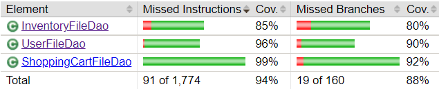

# PROJECT Design Documentation

## Team Information
* Team name: Engenuity
* Team members
  * Zachary Wagner
  * Daniel Pittman
  * Jensen DeRosier
  * Timothy Avila
  * Gabriel Buxo
  

## Executive Summary

This is a summary of the project.

### Purpose
> _Provide a very brief statement about the project and the most
> important user group and user goals._

### Glossary and Acronyms
> _Provide a table of terms and acronyms._

| Term | Definition |
|------|------------|
| SPA | Single Page |
| Stack | Spring API + Angular UI |

## Requirements

This section describes the features of the application.

> _In this section you do not need to be exhaustive and list every
> story.  Focus on top-level features from the Vision document and
> maybe Epics and critical Stories._

### Definition of MVP
> _Provide a simple description of the Minimum Viable Product._

### MVP Features
> _Provide a list of top-level Epics and/or Stories of the MVP._

### Roadmap of Enhancements
> _Provide a list of top-level features in the order you plan to consider them._

## Application Domain

This section describes the application domain.

> _Provide a high-level overview of the domain for this application. You
> can discuss the more important domain entities and their relationship
> to each other._

## Architecture and Design

This section describes the application architecture.

### Summary

The following Tiers/Layers model shows a high-level view of the webapp's architecture.

The e-store web application, is built using the Model–View–ViewModel (MVVM) architecture pattern. 

The Model stores the application data objects including any functionality to provide persistance. 

The View is the client-side SPA built with Angular utilizing HTML, CSS and TypeScript. The ViewModel provides RESTful APIs to the client (View) as well as any logic required to manipulate the data objects from the Model.

Both the ViewModel and Model are built using Java and Spring Framework. Details of the components within these tiers are supplied below.

### Overview of User Interface

This section describes the web interface flow; this is how the user views and interacts
with the e-store application.

> _Provide a summary of the application's user interface.  Describe, from
> the user's perspective, the flow of the pages in the web application._

### View Tier
> _Provide a summary of the View Tier UI of your architecture.
> Describe the types of components in the tier and describe their
> responsibilities.  This should be a narrative description, i.e. it has
> a flow or "story line" that the reader can follow._

> _You must also provide sequence diagrams as is relevant to a particular aspects 
> of the design that you are describing.  For example, in e-store you might create a 
> sequence diagram of a customer searching for an item and adding to their cart. 
> Be sure to include an relevant HTTP reuqests from the client-side to the server-side 
> to help illustrate the end-to-end flow._

### ViewModel Tier
> _Provide a summary of this tier of your architecture. This
> section will follow the same instructions that are given for the View
> Tier above._

> _At appropriate places as part of this narrative provide one or more
> static models (UML class diagrams) with some details such as critical attributes and methods._

### Model Tier
> _Provide a summary of this tier of your architecture. This
> section will follow the same instructions that are given for the View
> Tier above._

> _At appropriate places as part of this narrative provide one or more
> static models (UML class diagrams) with some details such as critical attributes and methods._

### Static Code Analysis/Design Improvements
> _Discuss design improvements that you would make if the project were
> to continue. These improvement should be based on your direct
> analysis of where there are problems in the code base which could be
> addressed with design changes, and describe those suggested design
> improvements._

> _With the results from the Static Code Analysis exercise, 
> discuss the resulting issues/metrics measurements along with your analysis
> and recommendations for further improvements. Where relevant, include 
> screenshots from the tool and/or corresponding source code that was flagged._

## Testing

The back end (API) was tested by creating and running JUnit tests. The front end (UI) was tested by manually manipulating the UI. These tests were used to find any bugs that existed in the stack. The tests also verified that the program has the correct operation at each tier of the stack.

### Acceptance Testing
> _Report on the number of user stories that have passed all their
> acceptance criteria tests, the number that have some acceptance
> criteria tests failing, and the number of user stories that
> have not had any testing yet. Highlight the issues found during
> acceptance testing and if there are any concerns._

### Unit Testing and Code Coverage

Before testing, we agreed on a code coverage target to meet while testing—this target aimed for 90% coverage. We set the target at 90% because it would ensure that the classes would be tested thoroughly for correct operation without wasting time on parts that are not significant.

We created and ran unit tests for each class we made on the back end (API). After running the tests, we ran a code coverage tool to generate a report on how well the JUnit tests covered our code. The code coverage report gave an average of 96% across each tier (Controller, Model, Persistence). This report shows that we exceeded our target and expectations. The breakdown of the report is shown below.

  * The code coverage for the Controller tier is 95%. 

    

  * The code coverage for the Model tier is 97%.

    

  * The code coverage for the Persistence tier is 97%

    

Further testing may be needed to cover more branches. However, this may be unnecessary as the missed branches do not seem essential and would be a waste of our limited time. 

