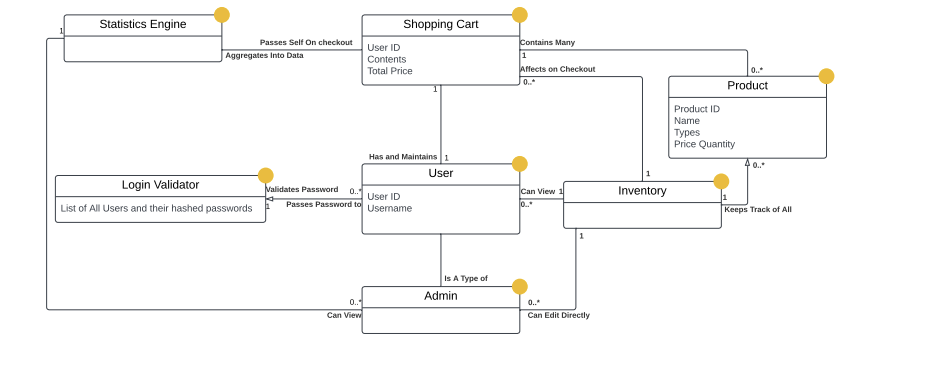
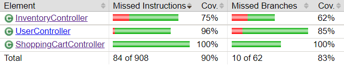
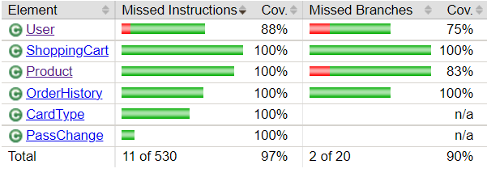

# PROJECT Design Documentation

## Team Information
* Team name: Engenuity
* Team members
  * Zachary Wagner
  * Daniel Pittman 
  * Jensen DeRosier
  * Timothy Avila
  * Gabriel Buxo
  
## Executive Summary

This is an E-Store designed to sell Pokémon Cards to customers. There are two types of users: customers and admins. The Customers can register and login to add cards to their shopping cart before checking out. Checking out removes the indicated quantity from each product and charges the customer accordingly. The admins are a class of user that is allowed to change the inventory of products directly instead of having to check out. This includes decreasing the quantity in stock, changing the price, and adding/removing products.

We have six objects we are keeping track of. The users, the products, and the shopping carts, order history, User statistics, and Store statistics. There are 4 DAOs, one for Users, one for the inventory, one for shopping carts and order histories, and one for User and Store statistics. The DAOs are responsible for retreiving data from the files, as well as editing the data in them. We also have 4 controllers following the same schema as the DAOs. They are responsible for handling http requests.

The UI executes http requests and takes the information in the responses and populates the UI with the information.

### Purpose

The purpose of this project was to create an online store application utilizing a programming stack that contains a Spring API and an Angular UI. The online store was made with the design concept of being to sell Pokémon trading cards.

    
### Glossary and Acronyms

| Term              | Definition                        |
| -----             | --------------------------------- |
| SPA               | Single Page Application                      |
| UI                | User Interface                    |
| API               | Application Programming Interface |
| Stack             | Spring API + Angular UI           |
| DAO               | Data Access Object                |
| UML               | Unified Modeling Language         |
| Statistics Engine | Statistics Calculator, storage, and retrieval |

## Requirements

This section describes the features of the application.

### Definition of MVP

* Customers and e-Store Admins can login and logout with a username and password
* Admin has a unique view that can control the inventory
        - Admin can Add a product, can Delete a product, can Update a product
        - The admin does not have a shopping cart 
* Customer can see a list of products, can search for a product, can add/remove an item to their shopping cart, and can checkout their items in their cart
* Customers items should save in their cart on logout

### MVP Features

* Admins can edit the inventory directly, but duplicate products are not allowed
* Each product has it's own id, name, price, and quantity
* These products can be added to customer's shopping carts by the customer, and then checked out
* When the shopping cart is checked out, the quantity of the product in the inventory is reduced by the appropriate amount
* Users should not be able to have duplicate usernames, and each has their own shopping cart that only they can change.
* The shopping cart is refreshed whenever the user logs in and before checking out
* Refreshing the cart checks the quantity in the cart against the quantity in the inventory to verify that the transaction can proceed, and updates the price if necessary

## Application Domain

This section describes the application domain.

There are three main entities interacting in our project. There is the customer, the admin, and the inventory. The admin directly edits the inventory, the inventory keeps track of products and users. The customer views the product side of the inventory, and adds the products to their shopping cart, which then removes the products from the inventory.

## Architecture and Design

The Architecture is split into 2 main sections. The API that handles all logic surrounding the persistance of data and the retrieval of data, and the UI, which handles the display of information. The API is further split into three sections, Models, DAOs, and Controllers. The Models are the representations of what we are keeping track of. The DAOs are responsible for storing, retrieving, and altering the persistant data that represents the Models in our system. The Controllers are responsible for handling http requests, calling the respective DAO functions, and then returning the information.

### Summary

The following Tiers/Layers model shows a high-level view of the webapp's architecture.

The e-store web application, is built using the Model–View–ViewModel (MVVM) architecture pattern. 

The Model stores the application data objects including any functionality to provide persistance. 

The View is the client-side SPA built with Angular, HTML, CSS, and TypeScript. The ViewModel provides RESTful APIs to the client (View) as well as any logic required to manipulate the data objects from the Model.

Both the ViewModel and Model are built using Java and Spring Framework. Details of the components within these tiers are supplied below.

### Overview of User Interface

This section describes the web interface flow; this is how the user views and interacts
with the e-store application.

The User vists the web application and automatically visits the home page. On the home page the user can see the products in the store, can search for a product and press a button to go to the login page. The login page allows a new user to register an account and login if the user is an existing user. On login the user is directed back to the home page. On login the homepage also has a button for the user to visit their own User page, and to view their shopping cart. The user can also click the login button when they are logged in to be redirected to a page to logout. 
    
The User also has access to a user page. The user can reach this page from the home page by clicking on a button in the top right corner of the application. This button will take them to their user page, where they can see their username, change their password, and view their past orders. 
    
Another button in the home page takes the user to their shopping cart. The shopping cart has the price of each individual item, the quantity of the item in the user's cart, and the total price of all items in the user's cart. The user can modify the quantity of each item in their cart by using the plus and minus buttons. The minus button is located on the left side of the quantity amount and when pressed will decrement the quantity of the product in the cart. When the quantity falls below 1, the item is removed from the user's cart. The plus button is located to the right of the shown quantity and when pressed will increment the quantity of the product in the cart. When the quantity in the user's cart is the same as the quantity of the product in the inventory, the quantity amount is capped and cannot be incremented further. As the user modifies the quantity of products in their cart, the total price will dynamically change without requiring the user to do any additional routing in the application for the changes to take effect.

    
### View Tier

Our view tier is our user's way of interacting with our backend and our products. A user's journey starts on our home page. It fetches information on the user and inventory from our User and Inventory services in angular which use http services to grab information from the backend. These are singletons for fetching information. The userService holds information on the user for access accross multiple different routes.
    
After logging in a user is brought back to the home page in order to view cards in the store and there is a button in order to go to their personal page.
    
In the case of the admin they see on their page a ui for adding, editing, and deleteing cards in the store. On the other hand, the user sees functionality for adding cards to their shopping cart, and checking out cards, which deletes said cards from the database.
    
If a customer is logged in then they see on their page their account information including a password change form and their order history.

### ViewModel Tier

The architecture for our project consists of four seperate Controllers that each have their own DAO and Model. The four controllers deal with requests that manipulate Product, User, Shopping Cart and Order History, and Store Statistics. All of which is stored in JSON files. Each controller calls their designated DAO, which views retrieves and validates the information in the files. The controllers return the data that the DAOs obtained, which allows anything with a connection to the controller to view the information in the DAO, and thus the models. 
    
The four controllers are connected as follows: The UserController can see and use the ShoppingCartController and the ShoppingCartController can see and use the InventoryController, however, the InventoryController cannot see or use the ShoppingCartController and the ShoppingCartController cannot see or use the UserController. This implementation is done to separate the logic and storage of shopping carts from users while also allowing the creation of shopping carts with the creation of users and the ability for shopping carts to do the logic necessary to refresh and have products added/removed from. This ViewModel Tier has been designed to ensure that single responsibility and restful behavior is of utmost concern.

### Model Tier

The model tier is the 'heart and soul' of the program. We have four different models that our program is keeping track of. 

The most important is the Product. The product is a template for the cards we are selling. Each card has a number of attributes, including a name, an id that increases sequentially with every product added, the quantity in inventory, the type(s) of the pokemon, and the price of the card. The ids do back fill, so if ID 1 is deleted then the next product added is now ID 1.
    
Next, we have a model representing a user. The user has an id that also increases sequentially, a username which is provided by on creation, and a hashcode for their password, also provided on creation. 

Antepenultimately, we have the shopping cart, which has an id that matches the user it is connected with, a total price that is dynamically calculated when products are added, and a set that contains the products the customer has added to their cart.

Penultimately, we have a model which represents order history. An order history object contains an ID which corresponds to the user that placed the order, the shopping cart that was purchased by the user, a unique order number, which increases sequentially and acts as an order ID, separate from the user ID, and a timestamp, representing the date and time that the order was placed.
    
Finally, we have a User Statistics and Store Statistics object. They both a have a similar function, which is to keep track of the statistics of both categories. The User Statistics keeps track of individual users while the store statistics keep track of the whole store. The attributes of the objects are slightly different, i.e. the store statistics keeps track of top 5 most popular types as opposed to the user statistics which only keeps track of favorite type.

    
### Sequence Diagrams
#### Update Products

Updating Products starts on the Product Component. After the Admin clicks on the Product Component, it is replaced with the Update Product Component. this component allows the admin to input the new information of the product. When the admin presses submit, the information is validated before being sent to the back end via a HTTP request sent by the InventoryService. If validation fails, the information is not sent.
    
The controller then receives the request and asks the DAO to update the product. The DAO then updates if the information is valid, otherwise returning null. The DAO returns this information to the controller which returns the product to the front end.

#### Add Product

Adding a Product starts on the Add Product Component. The component allows for an admin to pass in information for a new product. Upon pressing submit, the information is validated in the component before the InventoryService sends the information via a HTTP request to the backend. The controller receives the information and sends it to the DAO, where the information is validated again before the product is actually created. Then, the DAO returns the created product to the controller, which returns the new product to the front end.    

#### Add Product to Cart

    

    Adding Products to the user's cart is possible whenever the user has a Card Product component available to them. When rendering the component, the UI checks to see if the logged in user is a customer, in which case a button is rendered on the component. When the user clicks this button, the component sends a request to the ShoppingCartService on the frontend, which sends an http request to the back end. 

    

On the backend, the ShoppingCartController receives the HTTP request, and asks the DAO to add the provided Product to the provided User's cart. The DAO then checks to see if the given product exists in the database, and if it does the product is added and the changed Shopping Cart is returned to the controller which then returns the Changed Shopping Cart to the front end.

 
#### Checkout

    

Only a user can checkout, and the PayPal buttons are on the Checkout Component. Users can checkout and purchase their items when they have valid products in their shopping carts. When proceeding to checkout, their items are checked against the inventory to ensure everything in their cart is still available. When users checkout with PayPal, they can either sign into their PayPal account or checkout with a valid credit card. An HTTP request is sent to the back end when the payment is successful. When payment is not successful, or there are invalid items in their cart, a payment failed message will alert the user, and they will be redirected back to their cart.
    
On the backend, the ShoppingCartController receives the HTTP request and asks the DAO to check out the items in their cart. The DAO then checks if the items in the cart are valid items that exist inside the inventory and then proceeds to clear the cart and update the inventory. The DAO will then return the updated cart, and the controller will send an HTTP status of ok and the updated cart to the front end. On the other hand, if the cart has items that are not valid, the DAO will return null, and the controller will send an HTTP status of bad request to the front end.

    
#### Login

    

The user is offered to login when they are not already logged in and are on the login page. When logging in the user enters their username and password into a form. This form passes the information to the UI's userservice which then sends a login request to the server with the username and password.

Once the server recieves the username and password it asks the UserDao if a user exists under the given username. If one does not exist it returns a NOT_FOUND response. Otherwise it then asks the UserDao to validate that the provided password hashes to the same hash that is stored in our persistance layer. If the password is successfully validated the server sends back a Response of OK containing a user object with the given username and thier assigned id and the user is sent back to the home page to browse products.

### Static Code Analysis/Design Improvements

Overall the metrics are good except for code coverage. A lot of the missed branches were getters and setters, so we were fine with excluding some of the coverage, since they weren't complicated functions. The only bug is also identified as minor, so we were fine with leaving it. Smells were also minimized.

If the project were to continue, time would be spent improving everything. Refactoring all the code would clean up a lot of unnecessary complexity that exists in the code. We would also switch the JSON files to SQL databases to improve efficiency and expandability. Another significant change is to improve image/ website load time. The website currently may suffer if many products are added to the inventory. To enhance image load time, we would encode the image into base 64 and store it in the database as a part of the product. This would help improve efficiency since you would only need to make one request and wouldn't need to encode the image whenever you want a particular product. 
    
If the project were to continue the front end view also would be improved and take inspiration from the following wire frames. 

    
Home Page View (not Logged in)
    

    
Home Page View (Customer Logged in)
    

    
Home Page View (Admin Logged In)
    

Type Search UI Improvement
    

     
Admin DashBoard
    

## Testing

The back end (API) was tested by creating and running JUnit tests. The front end (UI) was tested by manually manipulating the UI. These tests were used to find any bugs that existed in the stack. The tests also verified that the program has the correct operation at each tier of the stack.

### Acceptance Testing

  * Nine User stories have passed all of their acceptance criteria tests
  * Zero User stories have failing acceptance criteria tests
  * All tests in the sprint have been tested and checked

While acceptance testing, we discovered we used a hash set for the shopping cart model but did not override the hashcode in the product model. This flaw caused issues when attempting to delete an item from a shopping cart, as the item would not delete. This flaw was not, however, caught in the Junit test. Even though a test was written to test this functionality, the test still passed. We are puzzled about why the test passed without implementing the hashcode in the product model, but we are pleased that this flaw has been corrected.

### Unit Testing and Code Coverage

Before testing, we agreed on a code coverage target to meet while testing—this target aimed for 90% coverage. We set the target at 90% because it would ensure that the classes would be tested thoroughly for correct operation without wasting time on parts that are not significant.

We created and ran unit tests for each class we made on the back end (API). After running the tests, we ran a code coverage tool to generate a report on how well the JUnit tests covered our code. The code coverage report gave an average of 97% across each tier (Controller, Model, Persistence). This report shows that we exceeded our target and expectations. The breakdown of the report is shown below.

  * The code coverage for the Controller tier is 96%. 

    

  * The code coverage for the Model tier is 95%.

    

  * The code coverage for the Persistence tier is 99%

    

Further testing may be needed to cover more branches. However, this may be unnecessary as the missed branches do not seem essential and would be a waste of our limited time.

### Passwords and multiple admins 10%

Users and Admins have passwords associated with them. They add the password when they are registered and the hash of the password is saved in our database using their username as a salt. In the event that two users attempt to have the same password, the generated hash is still unique to the user for increased security. Whenever someone attempts to log in with that username, they have to provide a password, the hash is then taken and compared to the user's hashed password. If the hash is the same, then the user is logged into the e-store.
    
Multiple admins can be created, but only from an admin's user page. Each admin has their own username and password, and can only be created by another admin. When an admin is created, they are given a unique negative ID to differentiate admin accounts from user accounts. Admin accounts are able to be deleted, however, it is impossible to delete the original admin account located at id of -1. If somehow that admin is deleted, upon system startup a new copy of this admin is created at the same id.

### Statistics Engine 10%

When a user is created, a blank statistics object is created with the same ID. Then, when that Customer checks out, the cart and the session time is sent to our statistics engine where the aspects of the cart are aggregated into the user's statistics object to produce accurate information on that user. The engine also aggregates the data into the store wide statistics. The admin can view all of this information on a specialized statistics page where they can see statistics for each individual user and for the entire store.

